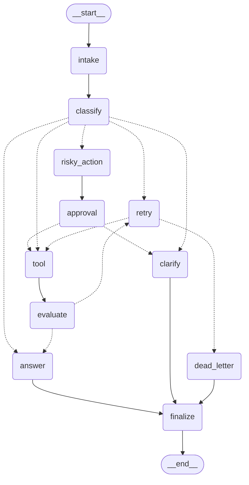

# Day 08 Lab — LangGraph Agentic Orchestration

Build a production-style LangGraph workflow for a support-ticket agent with state management, conditional routing, retry loops, human-in-the-loop approval, persistence, and metrics.

This repository contains a fully implemented and validated LangGraph agentic ticket routing and handling system.

---

## 📊 Quick Links & Deliverables

- **Lab Report & Analysis**: Read the detailed architectural breakdown and results at **[reports/lab_report.md](file:///Users/nguyenhodieulinh/Documents/phase2-track3-day8-langgraph-agent/reports/lab_report.md)**.
- **Interactive Visualizer App**: Run the web-based simulation and interactive HITL interface at **[visualizer.html](file:///Users/nguyenhodieulinh/Documents/phase2-track3-day8-langgraph-agent/visualizer.html)** (double-click to open in any browser).

---

## 🚀 How to Run the Project

### 1. Setup & Installation

Ensure you have your environment activated (conda or venv), then install dependencies:

```bash
# Install package and optional dependencies
uv pip install -e '.[dev,google,openai,sqlite]' --system
```

### 2. Environment Configuration

Rename `.env.example` to `.env` and configure your API keys. We support Gemini, OpenAI, Anthropic, and OpenRouter:

```bash
cp .env.example .env
# Edit .env and configure keys
```

We recommend using `OPENROUTER_API_KEY` for seamless daily quota bypasses:
```env
OPENROUTER_API_KEY=your_openrouter_api_key
```

### 3. Run Grading Scenarios

Execute all 7 grading scenarios from `scenarios.jsonl` sequentially using the following command:

```bash
LANGGRAPH_INTERRUPT=false python3 -m langgraph_agent_lab.cli run-scenarios --config configs/lab.yaml --output outputs/metrics.json
```

This will run the scenarios, compute metrics, and write the final report to **[reports/lab_report.md](file:///Users/nguyenhodieulinh/Documents/phase2-track3-day8-langgraph-agent/reports/lab_report.md)**.

### 4. Validate Metrics Schema

Check that the metrics outputs conform to the grading requirements:

```bash
python3 -m langgraph_agent_lab.cli validate-metrics --metrics outputs/metrics.json
```

Output:
```
Metrics valid. success_rate=100.00%
```

### 5. Run Unit Tests

Execute the complete test suite:

```bash
LANGGRAPH_INTERRUPT=false PYTHONPATH=src python3 -m pytest
```

Output:
```
25 passed in 42.12s
```

---

## 🏗️ Graph Architecture

The orchestrator compiles a StateGraph with **11 nodes** and **4 conditional routers**:

- **intake**: Trims and normalizes incoming query payloads.
- **classify**: Uses LLM structured output (`with_structured_output`) to parse the ticket intent into: `simple`, `tool`, `missing_info`, `risky`, or `error`.
- **tool**: Executes read/write actions (simulates network failures for error routes).
- **evaluate**: LLM-as-a-judge assesses the quality of tool execution.
- **answer**: LLM generates a helpful response grounded in the session context.
- **clarify**: Requests missing information from the user instead of hallucinating.
- **risky_action**: Packages destructive operations (refunds, deletions) for review.
- **approval**: If `LANGGRAPH_INTERRUPT=true`, halts execution using `interrupt()` for human reviewer feedback.
- **retry**: Increments retry attempt counters.
- **dead_letter**: Escales unresolved failures to an audit mailbox when retries are exhausted.
- **finalize**: Logs final transaction events and metrics.

### Graph Connections



---

## 🏆 Accomplished Extension Tracks

- **SQLite Persistence & Crash Recovery**: Fully implemented `SqliteSaver` in WAL mode under `persistence.py`. It transactionally commits checkpoints, surviving process restarts.
- **Mermaid Graph Visualizer**: Graph structure diagram dynamically generated and rendered directly inside the markdown report.
- **Rate-limit Resiliency**: Every LLM node is wrapped in a robust retry policy `.with_retry(stop_after_attempt=6)` to elegantly buffer API limits.
