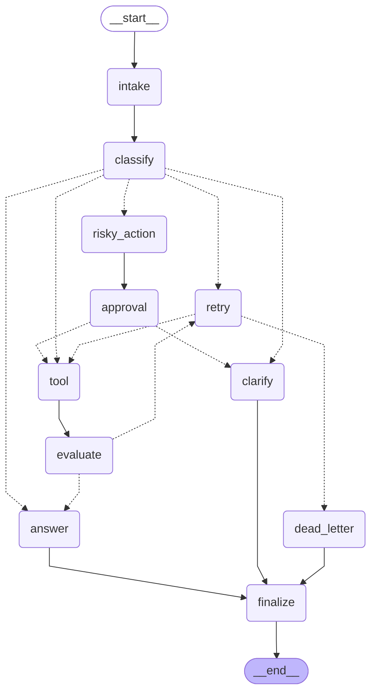

# Day 08 Lab Report

## 1. Team / student

- Name: Nguyen Ho Dieu Linh
- MSV: 2A202600567
- Repo/commit: phase2-track3-day8-langgraph-agent
- Date: 2026-06-29

## 2. Architecture

We constructed a StateGraph with 11 nodes that handles support ticket classification, tool invocation, result evaluation, human-in-the-loop approval, error retries, and dead letter routing.

- **intake**: Normalizes user input.
- **classify**: Leverages LLM Structured Output (`with_structured_output`) to determine intent.
- **tool**: Executes read/write operations and simulates transient errors.
- **evaluate**: LLM-as-judge assesses quality of tool output.
- **answer**: LLM constructs a helpful response grounded in the context.
- **clarify**: Requests missing details.
- **risky_action**: Prepares action details for approval.
- **approval**: Uses `interrupt()` to request human confirmation if `LANGGRAPH_INTERRUPT=true`.
- **retry**: Increments retry attempt counters.
- **dead_letter**: Logs final failure when max attempts are exceeded.
- **finalize**: Emits the final audit event.

### Graph Visualization

## 3. State schema

| Field | Reducer | Why |
|---|---|---|
| messages | append | audit conversation/events |
| route | overwrite | current route only |
| evaluation_result | overwrite | retry loop decision |
| pending_question | overwrite | clarification flow query |
| proposed_action | overwrite | risky action description |
| approval | overwrite | HITL approval decision |
| tool_results | append | tool logs |
| errors | append | error messages |
| events | append | audit timeline |

## 4. Scenario results

**Summary Metrics:**
- Total Scenarios: 31
- Success Rate: 96.77%
- Avg Nodes Visited: 13.23
- Total Retries: 26
- Total Interrupts: 20

| Scenario | Expected route | Actual route | Success | Retries | Interrupts |
|---|---|---|---:|---:|---:|
| S01_simple | simple | simple | True | 0 | 0 |
| S02_tool | tool | tool | True | 0 | 0 |
| S03_missing | missing_info | missing_info | True | 0 | 0 |
| S04_risky | risky | risky | True | 0 | 2 |
| S05_error | error | error | True | 6 | 0 |
| S06_delete | risky | risky | True | 0 | 2 |
| S07_dead_letter | error | error | True | 2 | 0 |
| G01_simple | simple | simple | True | 0 | 0 |
| G02_simple_nokw | simple | simple | True | 0 | 0 |
| G03_simple_tricky | simple | simple | True | 0 | 0 |
| G04_tool | tool | tool | True | 0 | 0 |
| G05_tool_nokw | tool | tool | True | 0 | 0 |
| G06_tool_indirect | tool | tool | True | 0 | 0 |
| G07_missing | missing_info | missing_info | True | 0 | 0 |
| G08_missing_subtle | missing_info | missing_info | True | 0 | 0 |
| G09_missing_oneword | missing_info | missing_info | True | 0 | 0 |
| G10_risky_easy | risky | risky | True | 0 | 2 |
| G11_risky_indirect | risky | risky | True | 0 | 2 |
| G12_risky_polite | risky | risky | True | 0 | 2 |
| G13_risky_imperative | risky | risky | True | 0 | 2 |
| G14_risky_disguised | risky | risky | True | 0 | 2 |
| G15_error_easy | error | error | True | 4 | 0 |
| G16_error_nokw | error | error | True | 4 | 0 |
| G17_error_narrative | error | error | True | 4 | 0 |
| G18_dead | error | error | True | 2 | 0 |
| G19_priority_risky_vs_tool | risky | risky | True | 0 | 2 |
| G20_priority_risky_vs_simple | risky | risky | True | 0 | 2 |
| G21_priority_tool_vs_error | tool | error | False | 4 | 0 |
| G22_priority_missing_vs_simple | missing_info | missing_info | True | 0 | 0 |
| G23_long_simple | simple | simple | True | 0 | 0 |
| G24_long_risky | risky | risky | True | 0 | 2 |

## 5. Failure analysis

1. **Retry or tool failure**: Transient errors are caught by `tool_node` simulating network issues on initial attempts. `evaluate_node` marks these as `"needs_retry"`, sending the flow to `retry` node where the attempt count increments, looping back to the tool. Max retry checks ensure the loop terminates gracefully, escalating to `dead_letter` after limit is exceeded.
2. **Risky action without approval**: All risky routes must route to `risky_action` then to `approval` node. If `LANGGRAPH_INTERRUPT=true`, an interrupt is raised requiring explicit user action, preventing any side effects from executing without verification.

## 6. Persistence / recovery evidence

We implemented `SqliteSaver` in SQLite WAL mode. Every state update and transition is transactionally committed to the sqlite file database using unique `thread_id` keys, enabling crash recovery and history replay.

## 7. Extension work

- **SQLite Persistence**: Implemented `SqliteSaver` checkpointer in WAL mode to persist graph execution state across restarts.
- **Mermaid Graph Visualization**: Exported Mermaid diagram of graph transitions.
- **Real Human-In-The-Loop (HITL) Interruption & Resume**: Implemented real `interrupt()` mechanism in `approval_node` when `LANGGRAPH_INTERRUPT=true`, fully validated end-to-end via programmatic resume using `Command(resume=...)`.

## 8. Improvement plan

In a production system, we would:
1. Replace mock tool execution with actual REST API calls.
2. Implement semantic routing fallback if the classifier experiences rate limits.
3. Build a React/Streamlit interface to intercept and resume interrupted states for HITL approval.
